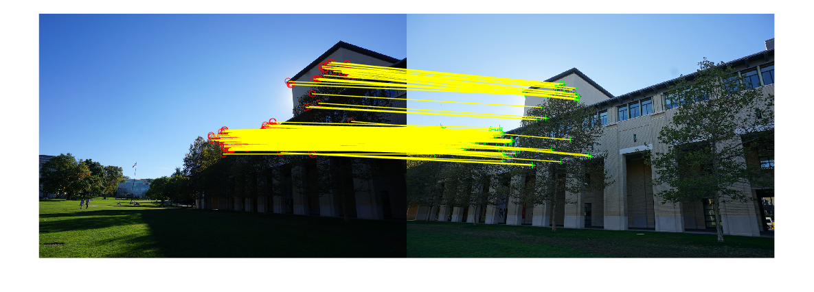
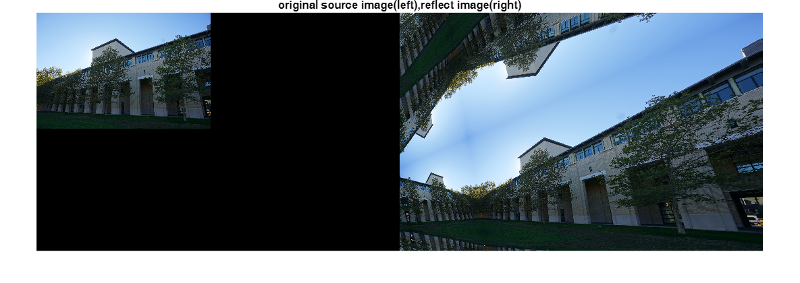
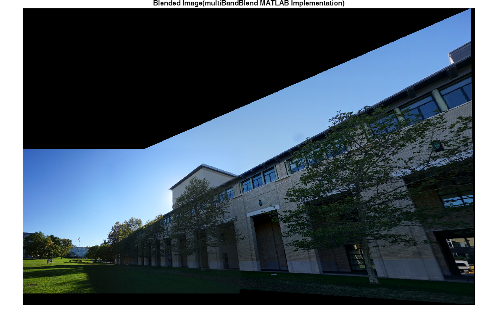

# Multi\-Band Blender MATLAB

[](https://matlab.mathworks.com/open/github/v1?repo=cuixing158/multiBandBlender&file=ExamplesEntry.mlx)
[](https://ww2.mathworks.cn/matlabcentral/fileexchange/179089-multibandblender)

Multi\-Band Blender在MATLAB中的实现示例，主要是展示如何使用[MultiBandBlender类](./MultiBandBlender.m)。

# Requirements

- MATLAB R2024b or later
- Computer Vision Toolbox™
- Image Processing Toolbox™

> [!NOTE]
> 如果需要在MATLAB环境中运行python代码，那么要安装[opencv\-python](https://pypi.org/project/opencv-python/)包。

# 示例1

本示例简单展示了两幅图像overlap区域的融合，从估计对齐的单应矩阵，然后使用alpha线性组合融合有比较明显的重叠区，随后使用multiBand融合可以明显改善效果。当然也支持对多幅图像输入融合，不限于本示例的2幅图像。

```matlab
%  img1 和 img2 是需要融合的两幅图像
img1 = imread('data/medium16.JPG');
img2 = imread('data/medium17.JPG');
imshowpair(img1,img2,"montage")
```


这2幅图像有比较大的亮度差异，特别是曝光有明显不同。

## 计算单应矩阵

使用典型传统的orb特征点算法和匹配，就可以得到从图像2到图像1的转换矩阵，该矩阵即单应矩阵包含在tform变量中。

```matlab
gray1 = im2gray(img1);
gray2 = im2gray(img2);

pts1 = detectORBFeatures(gray1);
pts2 = detectORBFeatures(gray2);

[features1,valid_points1] = extractFeatures(gray1,pts1);
[features2,valid_points2] = extractFeatures(gray2,pts2);

indexPairs = matchFeatures(features1,features2);

matchedPoints1 = valid_points1(indexPairs(:,1),:);
matchedPoints2 = valid_points2(indexPairs(:,2),:);

figure;
showMatchedFeatures(img1,img2,matchedPoints1,matchedPoints2,"montage");
```



```matlab

tform = estgeotform2d(matchedPoints2,matchedPoints1,"projective");
format shortG
disp("单应矩阵A：")
```

```matlabTextOutput
单应矩阵A：
```

```matlab
disp(tform.A)
```

```matlabTextOutput
      0.41316      0.17689       512.85
     -0.32616      0.85997       93.323
  -0.00046859   6.1022e-05            1
```

## 全景图像范围计算

要把对齐的图像完整显示出来，就要计算整幅全景图像的在全局坐标系下的坐标范围，MATLAB中一般使用[imref2d](https://ww2.mathworks.cn/help/images/ref/imref2d.html)来代表图像位置空间的坐标参考范围。

```matlab
[h1,w1] = size(img1,[1,2]);
[h2,w2] = size(img2,[1,2]);
pts_warp2 = transformPointsForward(tform,[1,w2,w2,1;1,1,h2,h2]');
pts_warp1 = [1,w1,w1,1;1,1,h1,h1]';
[minA,maxA] = bounds([pts_warp1;pts_warp2]);

panoramaWidth = round(maxA(1)-minA(1));
panoramaHeight = round(maxA(2)-minA(2));
xLimits = [minA(1),maxA(1)];
yLimits = [minA(2),maxA(2)];
R = imref2d([panoramaHeight,panoramaWidth],xLimits,yLimits)
```

```matlabTextOutput
R = 
  imref2d with properties:

           XWorldLimits: [1 2711.8]
           YWorldLimits: [-843.8 935.03]
              ImageSize: [1779 2711]
    PixelExtentInWorldX: 0.99993
    PixelExtentInWorldY: 0.9999
    ImageExtentInWorldX: 2710.8
    ImageExtentInWorldY: 1778.8
       XIntrinsicLimits: [0.5 2711.5]
       YIntrinsicLimits: [0.5 1779.5]
```

## mask掩码区域计算

由于拼接融合算法普遍需要各自输入图像对应的mask图像作为输入，依旧使用上述步骤中的包含对齐单应矩阵的变量`tform`，输出全局参考空间位置坐标范围`R`来计算。

```matlab
mask1_warped = imageWarp(ones(h1,w1,"logical"),rigidtform2d(),OutputView=R);
mask2_warped = imageWarp(ones(h2,w2,"logical"),tform,OutputView=R);
mask = mask1_warped&mask2_warped;

fg =  imageWarp(img1,rigidtform2d(),outputView=R);
bg = imageWarp(img2,tform,OutputView=R);

blendImg = imblend(fg,bg,mask1_warped,Mode="Alpha",ForegroundOpacity=0.6); % since R2024b
figure;
imshow(blendImg,R)
title('Blended Image(alpha blend)');
```


## multiBand融合

由于multiBand算法是基于拉普拉斯金字塔对各个频段的不同细节特征进行的融合，为丰富各个频段的像素特征及光滑过渡，故最好需要对输入图像边界像素“镜像”处理。

```matlab
img1_warped = imageWarp(img1,rigidtform2d(),OutputView=R,BorderMode="BORDER_REFLECT");
img2_warped = imageWarp(img2,tform,OutputView=R,BorderMode="BORDER_REFLECT");
imshowpair(img2,img2_warped,"montage") % 镜像像素处理可视化对比
title("original source image(left),reflect image(right)")
```



调用MATLAB实现的算法类MultiBandBlender，该类与OpenCV的MultiBandBlender基本兼容，接口API保持一致。如果对于多幅图像输入，那么`prepare()`函数后，对每一幅图像进行一次`feed()`操作，最后通过`blend()`重建全景融合图。频段层级数目一般在2~10之间，数值越大，过渡区域越顺滑。

```matlab
blender = MultiBandBlender(10);  % num_bands=10
blender = blender.prepare([1, 1, R.ImageSize(2),R.ImageSize(1)]);  % Prepare [x,y,width,height] global image area
```

由于之前已经计算单应矩阵，图像`img1_warped`，`img2_warped`已经对齐，故输入给`feed()`函数的第三个参数左上角点坐标为`[1,1]`。

```matlab
blender = blender.feed(img1_warped, mask1_warped, [1, 1]);  % Feed the first image and mask at position [1, 1]
blender = blender.feed(img2_warped, mask2_warped, [1, 1]);  % Feed the second image and mask at position [1, 1]
[dst, ~] = blender.blend();  % Perform the blending and get the result
figure;
imshow(dst)
title("Blended Image(multiBandBlend MATLAB Implementation)")
```



## opencv内置实现

此处直接调用opencv库的multiBlend看看融合效果，前提需要安装[opencv\-python](https://pypi.org/project/opencv-python/)包。关于更多信息请参阅：[Call Python from MATLAB](https://ww2.mathworks.cn/help/matlab/call-python-libraries.html)

```matlab
blender = py.cv2.detail_MultiBandBlender(int64(0),int64(10));% num_blend=10
blender.prepare(int64([0,0,R.ImageSize(2),R.ImageSize(1)])); % 总体全景图ROI区域，[x,y,width,height]形式

fm = im2uint8(mask1_warped);% 注意opencv是以uint8类型表示mask掩码
bm = im2uint8(mask2_warped);% 注意opencv是以uint8类型表示mask掩码

blender.feed(py.numpy.array(img1_warped),py.numpy.array(fm),int64([0,0]));
blender.feed(py.numpy.array(img2_warped),py.numpy.array(bm),int64([0,0]));

resultAndMask = blender.blend(py.None, py.None);

panorama = uint8(resultAndMask{1});
figure;
imshow(panorama)
title("Blended Image(opencv build-in multiBand)")
```


# 示例2

本示例展示了2幅图像在拼接缝的融合，同样，MultiBandBlender类一样灵活支持此类型的输入。

```matlab
img1_warped = imread("data/apple.png"); % apple1.png,dog.jpg
img2_warped = imread("data/orange.png");% orange1.png,cat.jpg
[height,width,c] = size(img1_warped);
mask1_warped = zeros(height,width,"logical");
mask1_warped(:,1:round(width/2))=1;
mask2_warped = 1-mask1_warped;

blender = MultiBandBlender(5);  % Create a blender with 5 bands 
blender = blender.prepare([1, 1,width,height]);  % Prepare for [1, 1,width,height] ROI image area
blender = blender.feed(img1_warped, mask1_warped, [1, 1]);  % Feed the first image and mask at position [1,1]
blender = blender.feed(img2_warped, mask2_warped, [1, 1]);  % Feed the second image and mask at position [1,1]
[dst, ~] = blender.blend();  % Perform the blending and get the result
figure;
imshow(dst)
```


为增强对比，对不同基本数目的num\_bands看看。

```matlab
for i = 1:5
    blender = MultiBandBlender(i);  % Create a blender with 5 bands
    blender = blender.prepare([1, 1,width,height]);  % Prepare for [1, 1,width,height] ROI image area
    blender = blender.feed(img1_warped, mask1_warped, [1, 1]);  % Feed the first image and mask at position [1,1]
    blender = blender.feed(img2_warped, mask2_warped, [1, 1]);  % Feed the second image and mask at position [1,1]
    [dst, ~] = blender.blend();  % Perform the blending and get the result
    figure;
    imshow(dst)
    title("blended image(numbands="+string(i)+")")
end
```


## References

[1]  [https://docs.opencv.org/4.9.0/d5/d4b/classcv\_1\_1detail\_1\_1MultiBandBlender.html](https://docs.opencv.org/4.9.0/d5/d4b/classcv_1_1detail_1_1MultiBandBlender.html)

[2] [Python with MATLAB](https://ww2.mathworks.cn/help/matlab/python-language.html)

[3]  [Laplace blending](https://www.uio.no/studier/emner/matnat/its/nedlagte-emner/UNIK4690/v17/forelesninger/lecture_2_3_blending.pdf)
